# Booking Frontend Setup Guide 

This guide will help you set up and run the React application for the project.

## Prerequisites

Ensure you have the following installed on your system:
- [Node.js](https://nodejs.org/) (LTS version recommended)
- [npm](https://www.npmjs.com/) or [yarn](https://yarnpkg.com/)

## Getting Started

Follow these steps to set up and run the application:

### 1. Clone the Repository
```bash
git clone https://github.com/Dhaval1112/booking-frontend.git
cd bookingproject/frontend
```

### 2. Install Dependencies
Run the following command to install the required dependencies:
```bash
npm install
```
or if you are using yarn:
```bash
yarn install
```

### 3. Start the Development Server
To start the React development server, run:
```bash
npm start
```
or with yarn:
```bash
yarn start
```

The application will be available at `http://localhost:3000` in your browser.

## Build for Production
To create a production build of the application, use:
```bash
npm run build
```
or with yarn:
```bash
yarn build
```

The production-ready files will be available in the `build` directory.

## Additional Scripts
- **Linting**: Run `npm run lint` to check for code quality issues.
- **Testing**: Run `npm test` to execute tests.

## Folder Structure
- `src/`: Contains the source code of the application.
- `public/`: Contains static files and the `index.html`.

## Troubleshooting
If you encounter any issues, ensure all dependencies are installed correctly and that your Node.js version matches the project's requirements.

## Reference Screenshots

Landing page
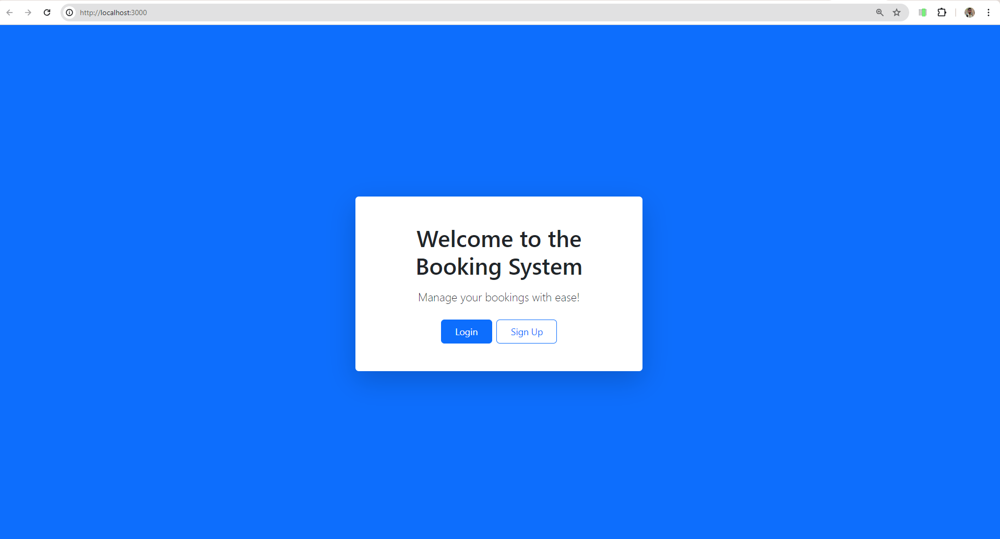

Signups page
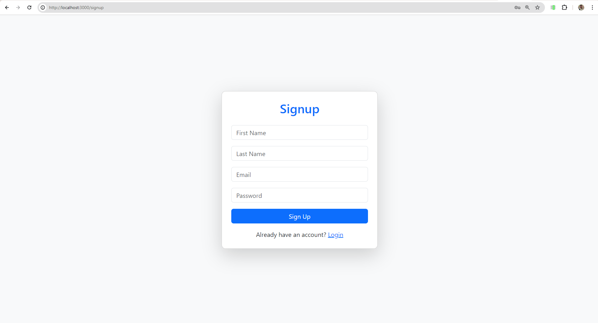

Login page
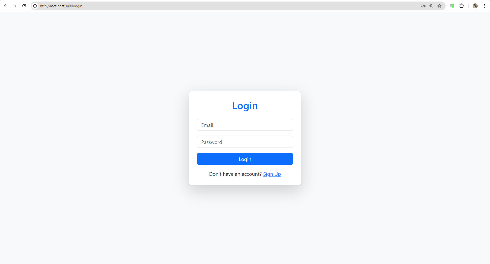

Dashboard page
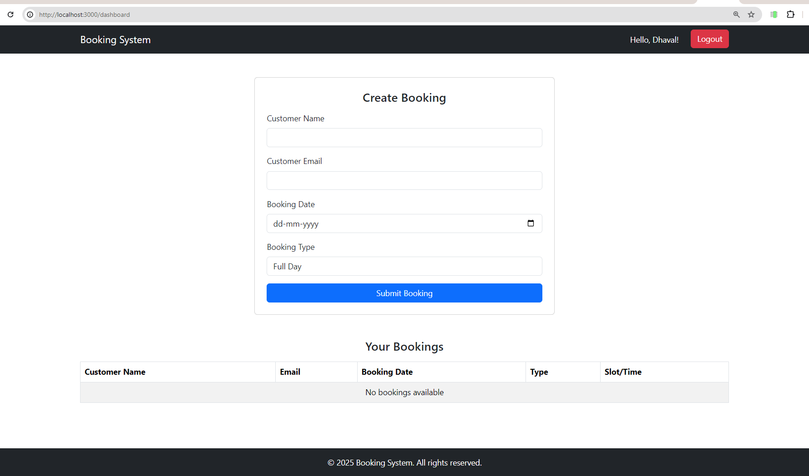

## Validations Screenshots
Signups page
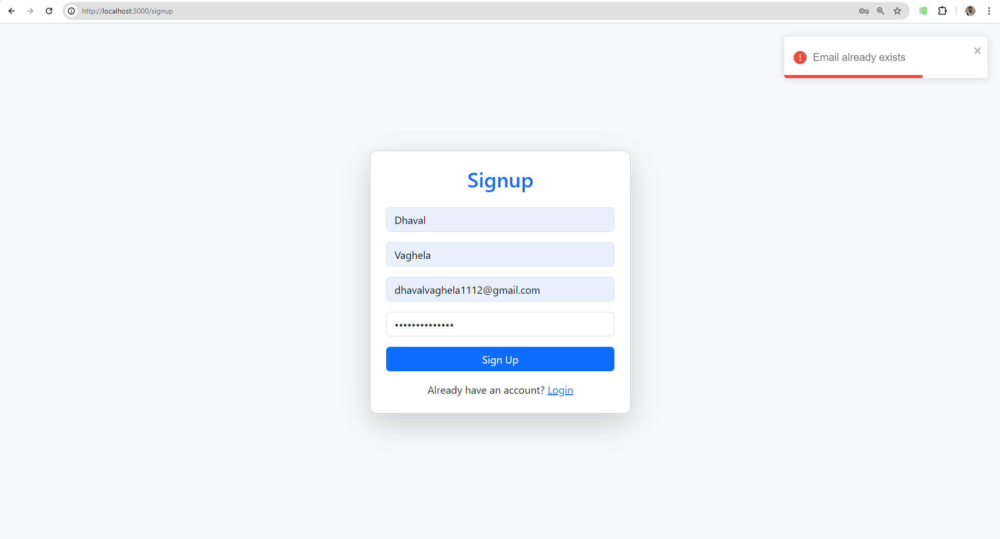

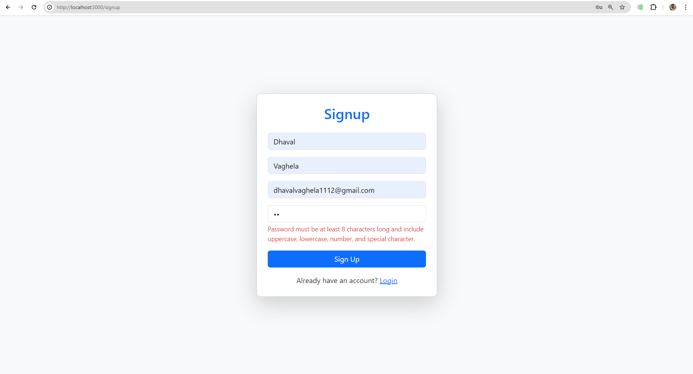

Login page
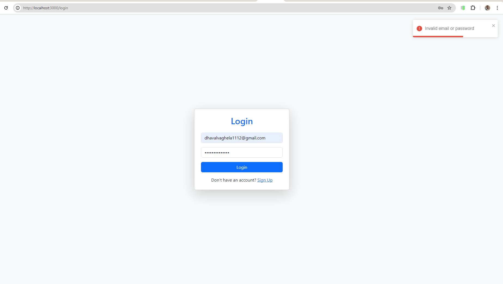

Booking Screen Validations
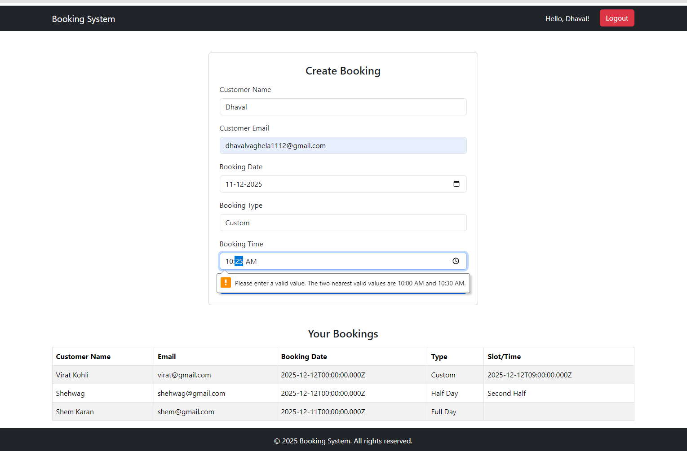

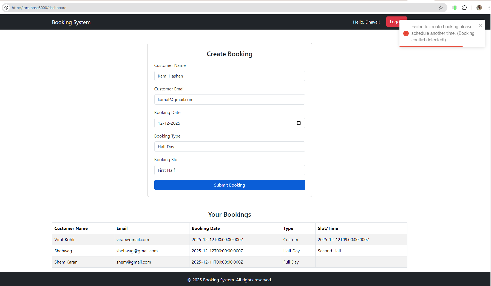

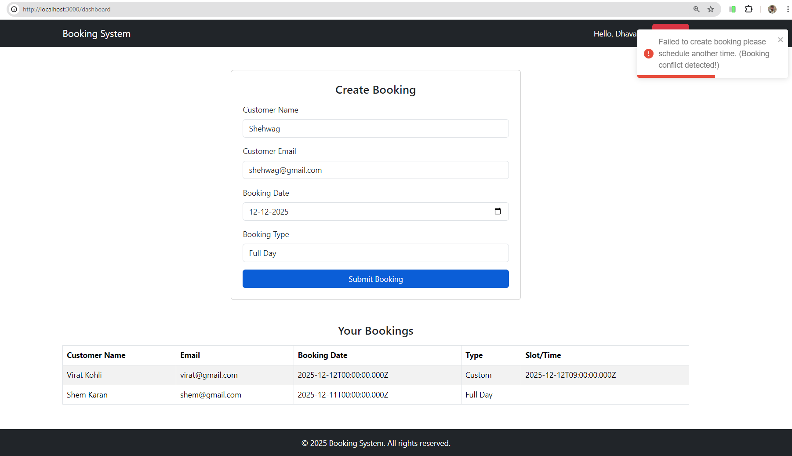

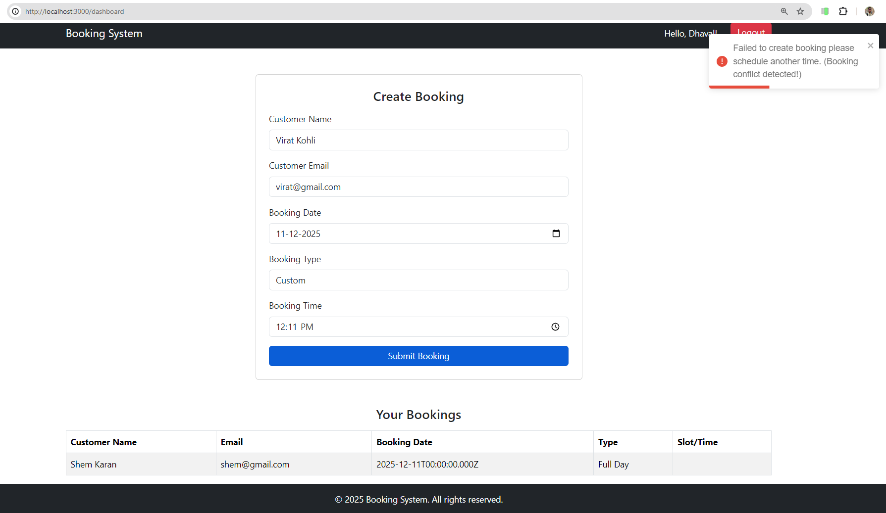

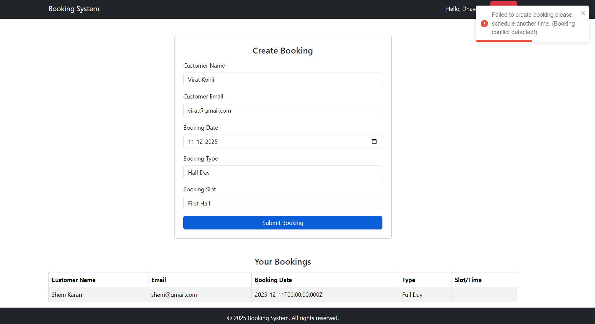

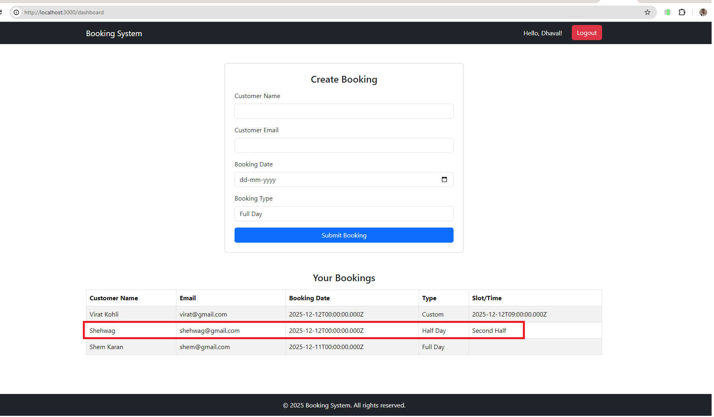


## License
This project is licensed under the [MIT License](LICENSE).